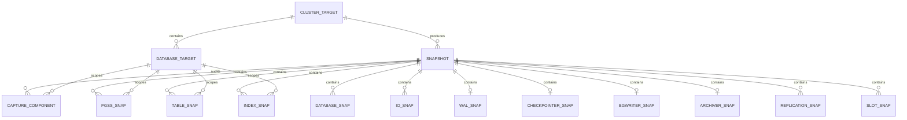

# Repository ER model



`snapshot` is the lifecycle parent. All metric rows are deleted through its
`ON DELETE CASCADE` relationships. `capture_component` is the data-quality
ledger: it identifies missing or failed metric families independently of the
snapshot payload.

The complete logical key for a statement is:

```text
database_target_id + userid + dbid + toplevel + queryid
```

`snapshot_id` is added to that key in `pgss_snap`. This prevents top-level and
nested statements from colliding when `pg_stat_statements.track = all`.
